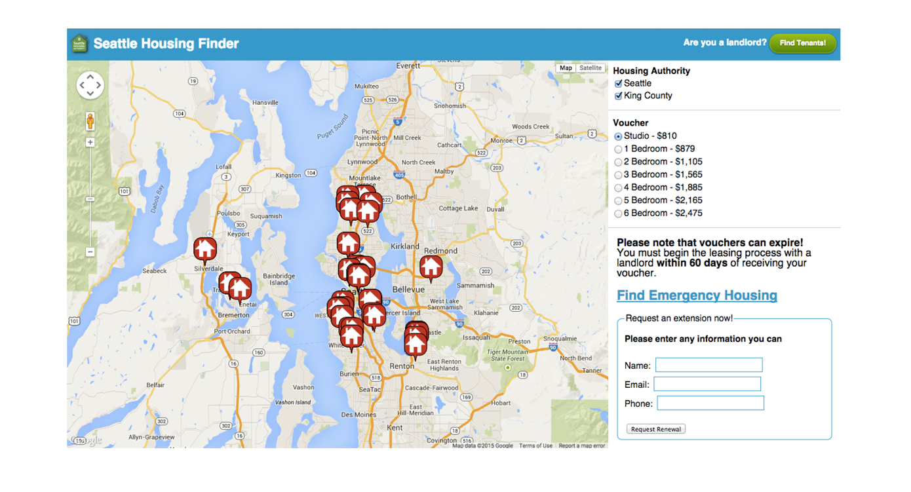

# Zillow #HackHousing Hackathon: Seattle Housing Finder

The purpose of this app is to provide an example of how to best format an app submission on [Github](http://github.com) for a hackathon. If you'd like to suggest changes or improvements to this example, feel free to send me a pull request.
Goals:
•	Establish a direct connect between Landlords and future Section 8 tenants.
•	Create a user-friendly website that gives the Section 8 voucher holders the proper information needed to get them placed in a house, access to an emergency shelter, or an extension on their voucher deadline.
•	Display relative and updated information from provided datasets as well as directly from the landlords.

This application was developed February 6-8, 2015 for the [Zillow #HackHousing Hackathon](http://www.eventbrite.com/e/hack-housing-empowering-smarter-decisions-a-weekend-hackathon-registration-15310832111).

Our app is live at http://section8connect.herokuapp.com/.

## Challenge and Approach

Our responds to [Challenge #2: Matching eligible tenants with accepting landlords is a perennial challenge – neither, it seems, has a central place to start looking for one another](http://zillow.mediaroom.com/download/Housing+Hackathon+-+Background.pdf%20).

Our approach for satisfying this challenge was to:

- Research and understand the current challenges facing voucher holders and prospective landlords
- Develop and iterate strategies in correspondence with HUD and SHA resources in order to provide incentive for landlords to reach out to those in need of housing
- Provide strategies for implementing this new technology - educating voucher holders and landlords of its existence and ability to quickly fill vacancies

## Team Members

Our team is comprised of:

[Pico Premvuti](http://students.washington.edu/natatp) – Computer Science, University of Washington 

[Daniel Sandoval](http://www.desandoval.net) – Human Centered Design and Engineering (UW) 

Imran Haroon – Former HUD Employee 

John-Paul Patrizio – Post Amazon Employee 

[Spencer Nusbaum](http://www.spencernusbaum.me) – Computer Science, Washington State University

Mitchell Barnette – Digital Technology and Culture (WSU)

## Technologies, APIs, and Datasets Utilized

We made use of:
- Google Maps JavaScript API
- Ruby on Rails
- Spencer's simple email API
- [Public Housing Buildings Dataset](http://zillowhack.hud.opendata.arcgis.com/datasets/2a462f6b548e4ab8bfd9b2523a3db4e2_0?geometry=-123.419%2C47.467%2C-121.245%2C47.745&filterByExtent=true&uiTab=table)

## Contributing

In order to build and run our app:

1. Pull from this repository
2. [Deploy the code](https://github.com/d3sandoval/hack-housing-section8connect) to [Heroku](http://heroku.com)
3. Run and test

